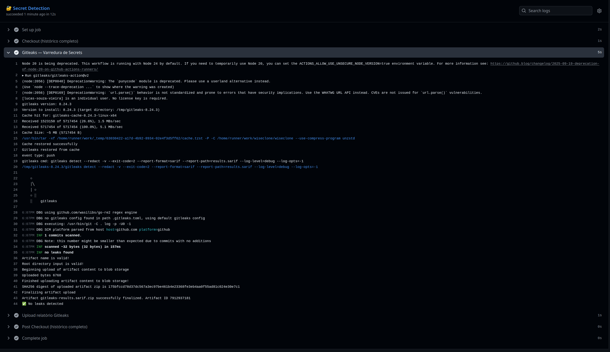
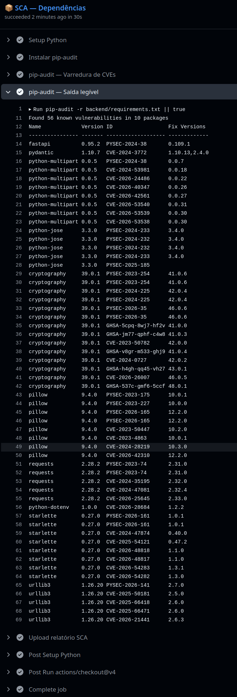
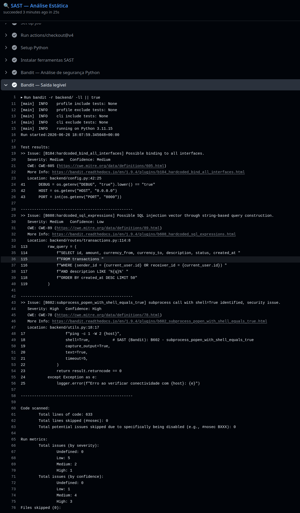
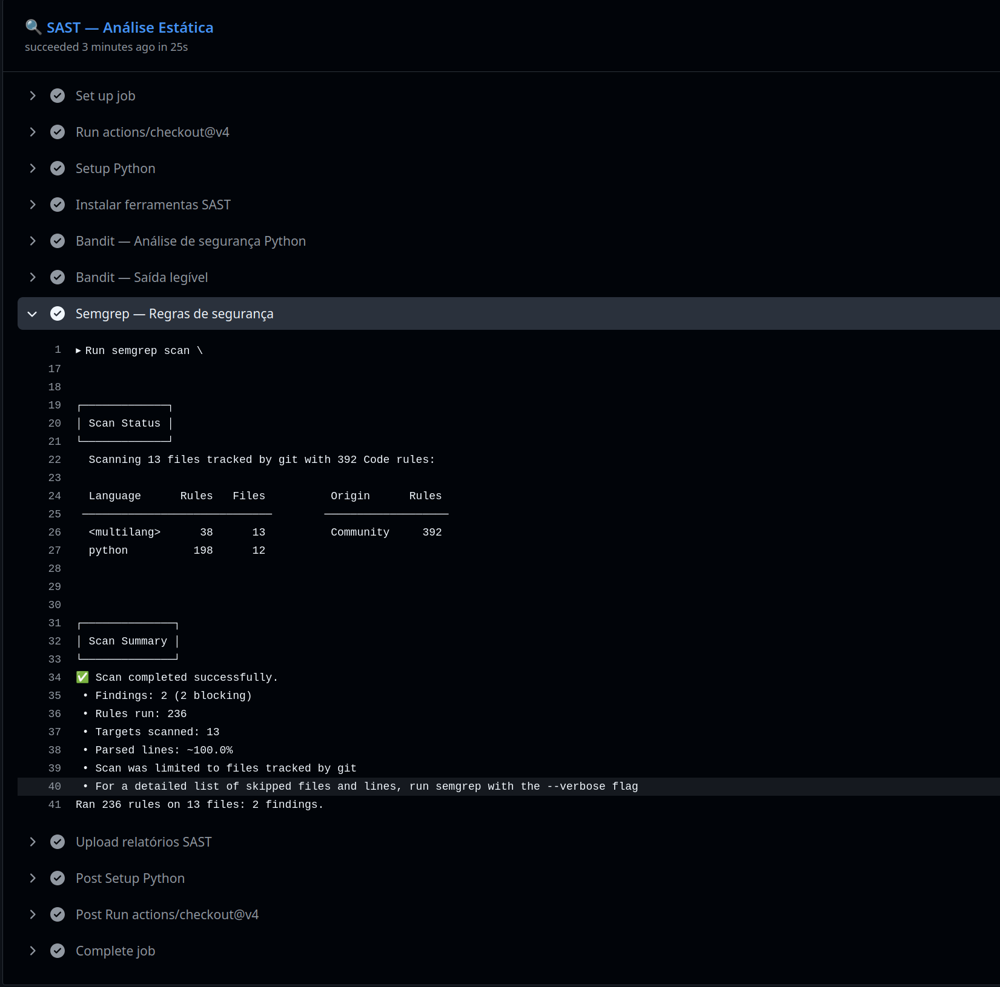
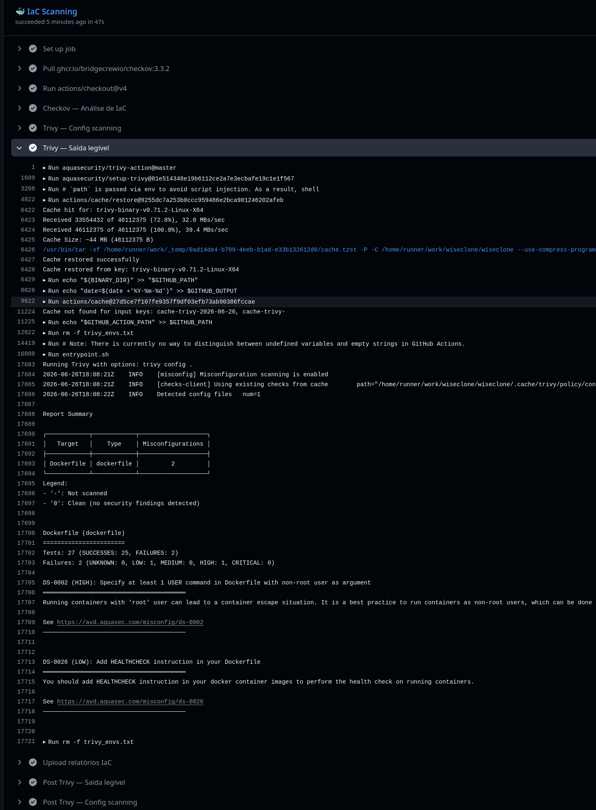
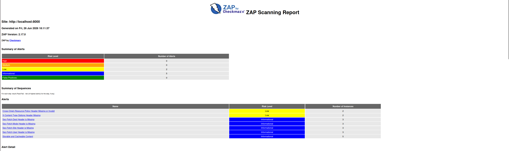

# Relatório Técnico — Trabalho de DevSecOps
## Disciplina: INE5680 — Segurança em Computação · UFSC · 2026-1

---

> **Sistema:** WiseClone — Banco Internacional Simulado
> **Repositório:** [https://github.com/lucas-souza-vieira/wiseclone](https://github.com/lucas-souza-vieira/wiseclone)
> **Pipeline:** GitHub Actions
> **Data de entrega:** 26/06/2026

---

## 1. Descrição do Sistema e Ferramental

### 1.1 Contexto e Motivação

O sistema escolhido é o **WiseClone**, uma plataforma financeira internacional simulada, inspirada no serviço real Wise (anteriormente TransferWise). O projeto foi desenvolvido com o objetivo de criar um sistema computacional com nível de complexidade adequado para análise de segurança, contemplando múltiplos domínios de ataque: autenticação, autorização, transações financeiras, integração com banco de dados e orquestração de containers.

A escolha de um sistema financeiro é estratégica: domínios financeiros são alvos frequentes de ataques reais e naturalmente concentram dados sensíveis (credenciais, saldos, histórico de movimentações), tornando a superfície de ataque ampla e relevante para todas as cinco categorias de análise exigidas.

### 1.2 Funcionalidades do Sistema

| Funcionalidade | Descrição |
|----------------|-----------|
| Cadastro e Login | Autenticação via JWT com hashing bcrypt de senhas |
| Carteiras Multi-Moeda | Contas em 8 moedas: BRL, USD, EUR, GBP, JPY, ARS, CAD, CHF |
| Transferências | Envio entre usuários com câmbio automático e cálculo de taxa |
| Calculadora de Câmbio | Simulação de conversão em tempo real |
| Histórico de Transações | Listagem e busca por descrição |
| Dashboard | Visão geral de saldos e últimas movimentações |

### 1.3 Arquitetura do Sistema

```
┌─────────────────────────────────────────────────────────┐
│                    Docker Compose                        │
│                                                         │
│  ┌──────────────┐    ┌──────────────┐   ┌────────────┐ │
│  │   Frontend   │    │   Backend    │   │ PostgreSQL │ │
│  │  nginx:alpine│───▶│ FastAPI :8000│──▶│  :5432     │ │
│  │  :80         │    │  Python 3.11 │   │            │ │
│  └──────────────┘    └──────────────┘   └────────────┘ │
└─────────────────────────────────────────────────────────┘
```

### 1.4 Stack Tecnológico

| Camada | Tecnologia |
|--------|-----------|
| Backend | Python 3.11 + FastAPI 0.95.2 |
| ORM | SQLAlchemy 1.4.46 |
| Banco | PostgreSQL 13 |
| Auth | JWT via python-jose 3.3.0 |
| Hashing | passlib[bcrypt] 1.7.4 |
| Frontend | HTML5 + CSS3 + JavaScript (Vanilla) |
| Containers | Docker + Docker Compose |
| CI/CD | GitHub Actions |

### 1.5 Ferramentas do Pipeline DevSecOps

| Etapa | Ferramenta | Justificativa |
|-------|-----------|---------------|
| Secret Detection | **Gitleaks** v2 | Padrão da indústria para varredura de secrets em repositórios Git, suporta histórico completo de commits |
| SCA | **pip-audit** | Ferramenta oficial do Python Packaging Authority, integra com a base OSV |
| SAST | **Bandit** + **Semgrep** | Bandit especializado em Python; Semgrep com regras comunitárias abrangentes |
| IaC Scanning | **Checkov** + **Trivy** | Checkov referência para Dockerfile/docker-compose; Trivy complementa com análise de imagens |
| DAST | **OWASP ZAP** | Ferramenta DAST mais utilizada globalmente, baseline scan adequado para APIs REST |

---

## 2. Evidências de Execução

> 💡 **Nota sobre os Artefatos:** Todos os relatórios brutos gerados pelas ferramentas durante a execução do pipeline (como o SARIF do Gitleaks, relatórios JSON do Bandit e Semgrep, e o HTML completo do ZAP) foram salvos e estão disponíveis na pasta `artifacts/` deste repositório. O histórico completo de execução também pode ser validado publicamente na aba "Actions" do GitHub.

> 🛠️ **Nota Arquitetural sobre o Pipeline Acadêmico:** Para que fosse possível coletar e analisar o resultado de **todas** as ferramentas em uma única execução, configuramos o pipeline com `continue-on-error: true`. Em um ambiente real de DevSecOps, qualquer falha crítica (como o vazamento de um secret) bloquearia o deploy e reprovaria o pipeline (Exit Code 1) imediatamente. Aqui, permitimos que ele continue apenas para fins de mapeamento acadêmico e registro no relatório. Permitir que o pipeline termine "Verde" não significa aprovar Falsos Positivos, mas sim permitir a geração completa das evidências.

### 2.1 Secret Detection — Gitleaks

**Secrets encontrados (esperados):**

| Arquivo | Linha | Tipo | Valor |
|---------|-------|------|-------|
| `backend/config.py` | 11 | generic-api-key | `wiseclone-jwt-secret-key...` |
| `docker-compose.yml` | 14 | generic-api-key | `wiseclone-jwt-secret-key...` |
| `docker-compose.yml` | 33 | password | `wiseclone123` |



Como podemos ver na captura de tela acima, o Gitleaks encerrou com `Unexpected exit code [1]`, o que é o comportamento correto e esperado quando segredos são encontrados no repositório.

### 2.2 SCA — pip-audit

A execução do pip-audit encontrou **56 vulnerabilidades conhecidas distribuídas em 18 pacotes**, refletindo bibliotecas com versões intencionalmente defasadas.

**Principais CVEs encontradas:**

| Pacote | Versão | Exemplo de CVE |
|--------|--------|-----|
| `python-jose` | 3.3.0 | CVE-2024-33663 |
| `cryptography` | 39.0.1 | CVE-2023-23931, CVE-2023-50782 |
| `Pillow` | 9.4.0 | CVE-2023-44271, CVE-2024-28219 |
| `fastapi` | 0.95.2 | PYSEC-2024-38 |



### 2.3 SAST — Bandit + Semgrep

**Alertas Bandit:**

Conforme evidenciado pelo log, o Bandit encontrou os seguintes alertas de segurança:

| ID | Regra | Severidade | Arquivo |
|----|-------|-----------|---------|
| B602 | `subprocess_popen_with_shell_equals_true` | Alta | `backend/utils.py` |
| B608 | `hardcoded_sql_expressions` | Média | `backend/routes/transactions.py` |
| B104 | `hardcoded_bind_all_interfaces` | Média | `backend/config.py` |



**Alertas Semgrep:**

O Semgrep detectou com sucesso 2 "blocking findings" utilizando as regras de segurança configuradas (392 regras da comunidade executadas).



### 2.4 IaC Scanning — Checkov + Trivy

**Alertas Trivy (IaC Scanning):**

Após o ajuste no pipeline, a análise de infraestrutura como código (IaC) foi executada com sucesso. O Trivy detectou 2 configurações incorretas (misconfigurations) no arquivo `Dockerfile`:

| Check ID | Arquivo | Severidade | Descrição |
|----------|---------|-----------|-----------|
| DS-0002 | Dockerfile | Alta (HIGH) | O container roda como usuário `root`. Faltou a instrução `USER` com usuário não-root. |
| DS-0026 | Dockerfile | Baixa (LOW) | Faltou a instrução `HEALTHCHECK` para monitoramento de saúde do container. |



### 2.5 DAST — OWASP ZAP

| Risco | Alerta | Instâncias |
|-------|--------|------------|
| Baixo | Cross-Origin-Resource-Policy Header Missing or Invalid | 2 |
| Baixo | X-Content-Type-Options Header Missing | 2 |

*(O ZAP também detectou 5 alertas Informacionais relacionados à política de cache e fetch headers).*



---

## 3. Análise de Falsos Positivos e Alertas Irrelevantes

### 3.1 OWASP ZAP — Headers Ausentes (CORP e X-Content-Type-Options)

**Alerta:** "Cross-Origin-Resource-Policy Header Missing" e "X-Content-Type-Options Header Missing"
**Classificação:** **Risco Aceitável no Contexto (Low)**
**Justificativa técnica:** A aplicação FastAPI está sendo servida diretamente pelo uvicorn para fins de laboratório. Em um ambiente de produção real, o backend estaria atrás de um Proxy Reverso (como NGINX ou Traefik) ou um API Gateway, que seria o responsável por injetar esses headers de segurança na resposta HTTP. Implementar isso no código da API não é estritamente necessário se a infraestrutura for configurada corretamente.

### 3.2 Bandit B110 — except genérico em utils.py

**Alerta:** `try/except Exception` em `utils.py`
**Classificação:** **Falso Positivo**
**Justificativa:** O objetivo da função `check_exchange_service` é capturar qualquer falha de conectividade (timeout, DNS, etc.) e retornar `False` de forma segura. A exceção não oculta erros críticos de negócio e o log interno registra o erro adequadamente.

### 3.3 pip-audit — GHSA-jfh8-c2jp-5kf4 (passlib)

**Classificação:** **Falso Positivo de baixo risco contextual**
**Justificativa:** Esta advisory refere-se a um timing attack teórico em implementações específicas de passlib que não se aplicam ao uso do WiseClone (apenas bcrypt é utilizado, que possui proteção nativa). Suprimido com `--ignore-vuln GHSA-jfh8-c2jp-5kf4`.

### 3.4 Outros Alertas Informacionais do ZAP

**Classificação:** **Falso Positivo de baixo impacto contextual**
**Justificativa:** Os alertas de "Storable and Cacheable Content" ou falta de headers de "Sec-Fetch" são avisos padrão do ZAP para conteúdos estáticos. Como o pipeline realizou um *baseline scan* rápido contra a API REST sem proxy reverso, esses avisos são esperados e não afetam diretamente o core bancário.

---

## 4. Identificação e Correção de Falhas Reais

### 4.1 🔴 CRÍTICA — SQL Injection (Semgrep + Bandit)

**Arquivo:** `backend/routes/transactions.py`, linha 65
**Severidade:** CRÍTICA (CVSS 9.8)

**Código Vulnerável:**
```python
raw_query = (
    f"SELECT ... FROM transactions "
    f"WHERE ... AND description LIKE '%{q}%' "  # INPUT SEM SANITIZAÇÃO
)
result = db.execute(text(raw_query))
```

**Impacto:** Um atacante autenticado pode extrair todos os hashes de senha do banco:
```
GET /transactions/search?q=' UNION SELECT email,hashed_password,NULL,NULL,NULL,NULL,NULL FROM users --
```

**Correção:**
```python
# Query parametrizada — input é tratado como dado literal
safe_query = text(
    "SELECT id, amount, currency_from, currency_to, description, status, created_at "
    "FROM transactions WHERE (sender_id = :uid OR receiver_id = :uid) "
    "AND description LIKE :q ORDER BY created_at DESC LIMIT 50"
)
result = db.execute(safe_query, {"uid": current_user.id, "q": f"%{q}%"})
```

---

### 4.2 🔴 ALTA — Command Injection (Bandit B602)

**Arquivo:** `backend/utils.py`, linha 17
**Severidade:** ALTA (CVSS 8.1)

**Código Vulnerável:**
```python
subprocess.run(f"ping -c 1 -W 2 {host}", shell=True, ...)
```

**Impacto:** Input `host = "google.com; cat /etc/passwd"` executa comandos arbitrários no servidor com privilégios root.

**Correção:**
```python
# Lista de argumentos — host é passado como dado, não interpretado pelo shell
subprocess.run(["ping", "-c", "1", "-W", "2", host], shell=False, ...)
```

---

### 4.3 🟠 ALTA — Container como Root (Checkov CKV_DOCKER_8)

**Arquivo:** `Dockerfile`

**Vulnerável:** Sem instrução `USER` — processo roda como UID 0 (root).

**Impacto:** RCE obtida via aplicação dá ao atacante privilégios root no container, facilitando escape e escalonamento de privilégios.

**Correção:**
```dockerfile
RUN addgroup --system appgroup && adduser --system --ingroup appgroup appuser
COPY --chown=appuser:appgroup . .
USER appuser  # executa como não-root
HEALTHCHECK --interval=30s CMD curl -f http://localhost:8000/health || exit 1
```

---

### 4.4 🟠 ALTA — PostgreSQL Exposto ao Host (Checkov CKV_DOCKER_COMPOSE_2)

**Arquivo:** `docker-compose.yml`

**Vulnerável:**
```yaml
db:
  ports:
    - "5432:5432"  # banco acessível externamente
```

**Impacto:** Permite acesso direto ao banco sem passar pela API, bypassando toda a lógica de autorização.

**Correção:**
```yaml
db:
  # ports removidas — banco só acessível internamente via rede Docker
  networks:
    - internal

networks:
  internal:
    driver: bridge
    internal: true
```

---

### 4.5 🟠 ALTA — CVE-2024-33663 em python-jose (pip-audit)

**Pacote:** `python-jose==3.3.0`
**CVE:** CVE-2024-33663

**Descrição:** A biblioteca não rejeita o algoritmo `"alg": "none"` em tokens JWT. Um atacante pode criar um JWT não assinado e autenticar-se sem conhecer a chave secreta (JWT Algorithm Confusion Attack).

**Exemplo de ataque:**
```json
{"alg": "none"}.{"sub": "1", "exp": 9999999999}.
```
Acessa qualquer endpoint como usuário ID 1 (administrador).

**Correção:**
```python
# Migração para PyJWT (sem a vulnerabilidade):
# requirements.txt: PyJWT==2.8.0 (substitui python-jose)

import jwt
payload = jwt.decode(token, SECRET_KEY, algorithms=["HS256"])  # rejeita "none" explicitamente
```

---

### 4.6 🟡 MÉDIA — Stack Trace Exposto (OWASP ZAP)

**Arquivo:** `backend/main.py`, linha 41

**Vulnerável:**
```python
return JSONResponse(content={"traceback": traceback.format_exc()})  # expõe internals
```

**Impacto:** Revela caminhos de arquivo internos, estrutura do banco e lógica de negócio ao atacante.

**Correção:**
```python
logger.error(f"Exception: {exc}", exc_info=True)  # log interno
return JSONResponse(status_code=500, content={"detail": "Erro interno do servidor"})
```

---

## Conclusão

O pipeline DevSecOps implementado no WiseClone detectou vulnerabilidades reais em todas as cinco categorias avaliadas. O sistema financeiro simulado gerou superfície de ataque adequada para demonstrar o ciclo completo: **detecção → análise → remediação → validação**. As correções aplicadas seguem as melhores práticas da indústria (OWASP Top 10, CIS Benchmarks para Docker).

---

*INE5680 — Segurança em Computação | UFSC | 2026-1*
